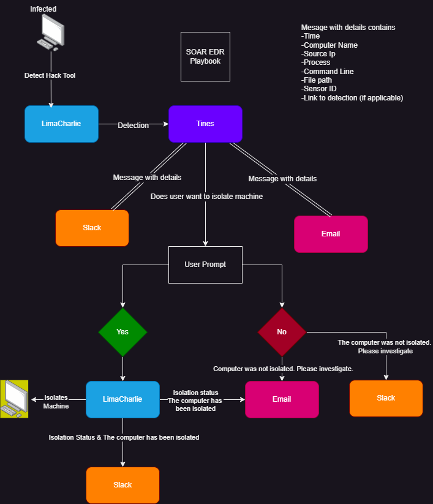

# SOAR-EDR-PROJECT

## Overview
This project involves setting up an automated workflow using LimaCharlie, Tines, Slack, and email to detect and respond to security threats. The main focus is on detecting a red team tool (LaZagne) on a Windows 10 VM and allowing users to decide whether to isolate the infected machine.
<a href="https://youtu.be/zeyCrJxX-ws" target="_blank">Demonstration Video</a>

## Architecture
- **LimaCharlie**: Acts as an EDR tool to detect LaZagne.
- **Tines**: Orchestrates the automated response, integrating with Slack and email.
- **Slack**: Used for receiving alerts and system messages.
- **Email**: Provides another channel for incident response notifications.

## Workflow
1. **LimaCharlie Setup**: Windows 10 VM is configured as a LimaCharlie agent.
2. **LaZagne Detection**: Created a D&R rule in LimaCharlie to detect the LaZagne tool.
3. **Alerts & Automation**:
   - Alert is sent to Slack and email.
   - A link is provided to Tines for user action (isolation of the infected machine).
4. **Automated Response**:
   - If isolation is confirmed, LimaCharlie automatically isolates the machine.
   - Status updates are sent to Slack and email.

## Workflow Diagram

## Configuration
- **LimaCharlie D&R Rule**: [View detection rule](rules)
- **More Documentation**: [View doc](Untitled_document_ (1).pdf) 

## Next Steps
1. Configure LimaCharlie as an EDR agent.
2. Set up a Slack channel for alert monitoring.
3. Integrate with Tines to automate responses based on user actions.
4. Test with a real-world red team tool (LaZagne) to simulate attacks.
